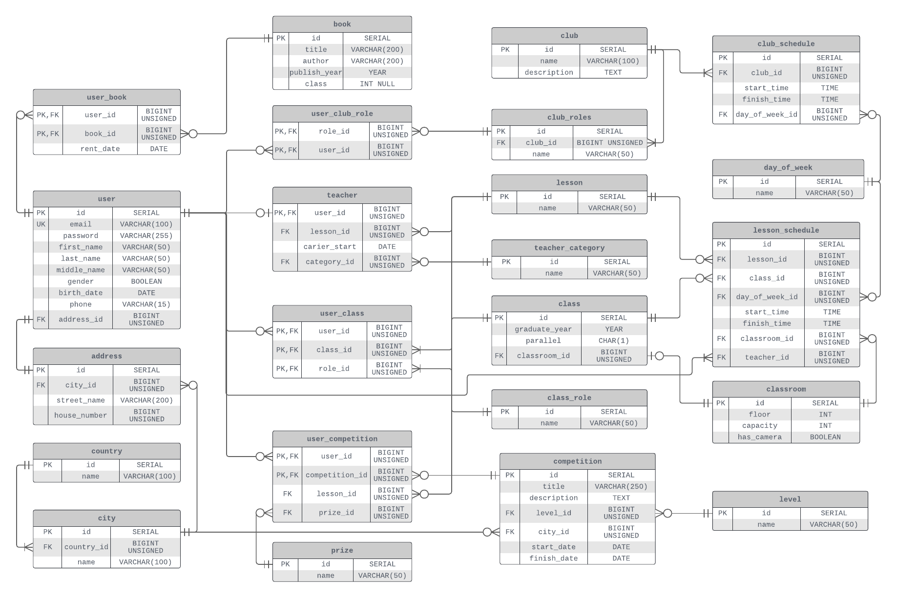

# School management system



## Table of contents
1. [Abstract](#abstract)
1. [Introduction](#introduction)
1. [Purpose of the project](#purpose-of-the-project)
1. [Project creation outline](#project-creation-outline)
1. [Entities](#entities)
1. [Business rules](#business-rules)
1. [Attributes](#attributes)
1. [Database normalization](#database-normalization)
1. [Potential future upgrades](#potential-future-upgrades)
1. [Conclusion](#conclusion)
1. [List of used literature and resources](#list-of-used-literature-and-resources)
1. [Queries](#queries)

## Source code
* [Create database tables and constraints](create_database.sql)
* [Alter table](alter_table.sql)
* DML statements
    * [Insert](insert.sql)
    * [Update](update.sql)
    * [Delete](delete.sql)
* [Queries and subqueries](#queries)

# Abstract
* Project sector
    * Education
* Project name
    * School management system
* Company
    * Karagandy "Bilim-Innovation" lyceum #1 for boys
* Project objectives
    * Learn core principles of database architecture
    * Get better at writing SQL queries
    * Understand what is database normalization
    * Practise at designing entity-relationship diagrams
    * Create real database for school
* Project author
    * University: Astana IT University
    * Group: SE-2019
    * Student: Temir Mendigali

[Back to table of contents](#table-of-contents)

# Introduction
As we all know, today the state program Digital Kazakhstan is being implemented, the purpose of which is to improve the quality of life of the population through the use of digital technologies. One of the areas of this program is the digitalization of education, in particular the digitalization of educational institutions.

For this reason, I decide to choose this topic. I decided to implement this global project locally, in the territory of my former school. When I was in school, I often faced various problems that I tried to solve in this project. One such problem was the paperwork, namely sorting documents by year and subject. The school kept the achievements of students at various Olympiads and competitions. In addition, I was a robotics Olympiad and I needed to keep track of everyone who participated in this club. So, the goal of my project is to create a database which will store information about school, its students, teachers and alumnees.

The Database Management System is practical because users can access it from various platforms at any time. Also, a digital database eliminates the need to store a huge amount of paper documentation, and more importantly, speeds up the processing of information at times.

[Back to table of contents](#table-of-contents)

# Purpose of the project
My goal is to create database for Karagandy “Bilim-Innovation” lyceum #1. Teachers at the school have been collecting student achievements in paper version for many years. Using the data in this form is not very convenient and for this reason, later they have begun transferring these papers into digital format, in the form of Microsoft Excel and Word files. But this option also has its drawbacks, because in order to access the data you need to transfer it from one computer to another in various ways, for example, via a USB flash drive. So therefore, I believe that transferring all this information to a database management system will be a very correct, relevant and logical solution of this problem.

The school keeps track of students, teachers, graduates, tutors and other staff. All these users will be able to register a personal account. The school has around 250 students, 40 teachers and administrators, 10 tutors. There are nearly 30 classrooms, 10 classes, each class has its own curator, tutor, classroom teacher, 25 subjects, 10 clubs. The database will need to contain their information, such as name, surname, birthday, class, his contacts, the clubs that the student is a member of, the subject in which he participates in the Olympiads, and it is also necessary to save the achievements of students at these Olympiads and competitions. Olympiads will contain following attributes name of the Olympiad/competition, a result (medal, certificate), place and date of the event. At the same time, the teachers will keep the subject they teach, their experience, qualifications, education, and more. Moreover, there will be other features such as: competitions calendar, lessons schedule, clubs schedule, tracking of books from library.

[Back to table of contents](#table-of-contents)
<!-- List of all the entities that are used in database -->
# Project creation outline
To complete this project, I decided to create an action plan that I will rely on during the creation process. I have identified the following steps for myself:
* Determine all entities contained in the project.
* List the business rules to be followed in the project.
* Design ER diagram including all the attributes for each entity and relationship.
* Create all entities, relationships and attributes in the database using SQL.

[Back to table of contents](#table-of-contents)

# Entities
The first step in creating this project was to define the entities that will be stored in the database. I have defined 14 entities for this project.
1. User
1. Lesson
1. Club
1. Club role
1. Class
1. Classroom
1. Book
1. Competition
1. Teacher
1. Address
1. Lesson schedule
1. Club schedule
1. Country
1. City

[View source code of the entities](create_database.sql)

[Back to table of contents](#table-of-contents)

# Business rules
After that, I began to draw up business rules that will guide me during the creation of the project and when designing the database. Below is a list of my business rules.
* A user can be associated with a class multiple times and have different roles in that class.
* A club can have many roles.
* Each teacher can teach one lesson.
* A student can join several clubs.
* A student can get an unlimited number of achievements in different competitions.
* A student can take only one prize place within one competition.
* At one competition, a student can participate in only one lesson.
* The student can borrow several books from the library.
* Each class has its own classroom.
* The club may have several scheduled classes.
* The user can only specify one address.
* Each class can attend several lessons.
* Each lesson can be in the lesson schedule several times.
* Different lessons from the lesson schedule can take place in a classroom.
* Each city can only be in one country.
* Each address can be linked to one city.
* The competition can only be held in one city.
* Teacher can have zero or one category.

[Back to table of contents](#table-of-contents)

# Attributes
* User can have full name, date of birth, gender, email, password, phone number, and address.
* Address consists of city, street name, and house number.
* Country has name.
* City has name and unique number of country where it is located.
* Teacher has lessons that he teaches, start date of his career, and his category.
* Class has a graduation year, parallel, classroom, and users who have particular roles in the class.
* Classroom has capacity of students, floor, number, and labeled if it has camera or not.
* Competition has title, description, level, location city, and date.
* Book has title, author, publish year, and if it is classbook, then it has a class number for which it is intended.
* Club has name, description and roles.
* Lesson has name.
* Lesson schedule consists of class, lesson, classroom, time of lesson, day of the week.
* Club schedule consists of club, time of meeting, and day of the week.

[Back to table of contents](#table-of-contents)

# Database normalization
1. First Normal Form (1NF)
For a table to be in the First Normal Form, it should follow the following rules:
    * Attributes should only have atomic values.
    * All attributes in a table should have unique names.
    * Values stored in a column should be of the same domain.

1. Second Normal Form (2NF)
For a table to be in the Second Normal Form, it should follow the following rules:
    * It is in the 1NF.
    * It does not have Partial Dependency.

1. Third Normal Form (3NF)
For a table to be in the Third Normal Form, it should follow the following rules:
    * It is in the 2NF.
    * It does not have Transitive Dependency.

When considering and studying the above ER diagram, it can be argued that all tables here are in 3NF, since they meet all the requirements. Each table has a primary key. The diagram shows all foreign keys and the relationship between them.

[Back to table of contents](#table-of-contents)

# Potential future upgrades
This project can already be used, but like any other project, it can be improved. I think that in the future it will be advisable to add support for other languages, which will allow storing information in several languages. In addition, you can add the ability to create blog posts in which you can write about interesting events that happened at the school. It will also be possible to add the ability to create a calendar of upcoming events, which will be very useful. It will also be possible to realize the opportunity for incoming sixth graders to apply to study at the school. In general, this project can still grow and improve a lot.

[Back to table of contents](#table-of-contents)

# Conclusion
It was a very interesting and, above all, useful project. As a result of the work done, we have a database that provides the school with the ability to register a personal account for each user. Each user can add information about themselves, such as name, date of birth, gender, place of residence, cell phone number, etc. In addition, the database allows you to store student achievements and get immediate access to them, with the ability to filter and sort the data. For each competition, its name, description, city and date of the event, as well as the scale of the competition, for example, international or republican, etc., are stored. Thanks to this, teachers will have less workload and, accordingly, they will be able to devote more time to teaching students than to paperwork. Now students can follow the schedules of lessons and club meetings, and see the members of each of the clubs. Students have the opportunity to view the books available in the library and, if they wish, take it for a while to read. It is also worth noting that teachers can add information that applies only to them, for example, the date of the beginning of their working career, the subject they teach, their teaching category.

Also, I personally learned a lot of important and valuable experience from this project. I improved my query writing skills and got a better understanding of how to build a database from scratch. I also got acquainted with database normalization and applied 3 normal forms in this project. Of course this is not the limit and there are other normal forms besides the three and I plan to learn how to apply the remaining forms in the future. For this project, I also learned how to create an entity relationship diagram using crow's foot notation. At first glance it seems difficult, but with a little practice it becomes much easier.

[Back to table of contents](#table-of-contents)

# List of used literature and resources
* Learn SQL (using MySQL) in One Day and Learn It Well. SQL for Beginners with Hands-on Project. The only book you need to start coding in SQL immediately. - By Jamie Chan.
* Learning SQL Generate, Manipulate, and Retrieve Data Third Edition. - By Alan Beaulieu.
* [MariaDB Documentation](https://mariadb.com/kb/en/documentation/)
* [MySQL Documentation](https://dev.mysql.com/doc/)
* [W3Schools SQL Tutorial](https://www.w3schools.com/sql/)

[Back to table of contents](#table-of-contents)

# Queries
1. [Show list of the teachers and lessons that each of them teach.](#query-1)
1. [Show list of classes and their classrooms.](#query-2)
1. [Show lesson schedule for class with id equal 1.](#query-3)
1. [Show achievements of every student on any competition.](#query-4)
1. [Show competitions where level of competition starts with "Rep".](#query-5)
1. [Show information about each headman in school.](#query-6)
1. [Show number of participants for each club.](#query-7)
1. [Show different lessons that are attended by students who will graduate in 2020 or in 2021.](#query-8)
1. [Show only curators and user with birthday between 6 july 2003 and 21 november 2005.](#query-9)
1. [Show minimum and maximum capacity of students that can fit in one classroom which has no camera inside.](#query-10)
1. [Show the earliest starting lessons.](#query-11)
1. [Show list of teachers who teach 3 lessons in which students win the most prizes in competition.](#query-12)
1. [Show lessons that take place in classrooms with a capacity of more than 21 people.](#query-13)
1. [Show details about teachers who teach lessons earlier than at 12:00.](#query-14)
1. [Show first name, country, city, address of users who participate in cybersport club.](#query-15)
1. [Show the most experienced teachers (those who have working experience > 30 years or any teacher category excluding "Without category").](#query-16)
1. [Show each student of the school.](#query-17)
1. [Show list of curators and tutor.](#query-18)
1. [Show students and their club, even if they have not joined any.](#query-19)
1. [Show schedule for clubs.](#query-20)

[Back to table of contents](#table-of-contents)

---
# Query 1
Show list of the teachers and lessons that each of them teach.

**SQL command:**
```sql
SELECT `user`.`first_name`, `user`.`last_name`, `lesson`.`name`
FROM `user`
INNER JOIN `teacher`
ON `user`.`id` = `teacher`.`user_id`
INNER JOIN `lesson`
ON `teacher`.`lesson_id` = `lesson`.`id`;
```
**Output result after executing SQL command:**

<!-- Put query 1 result table -->
| first\_name | last\_name | name |
| :--- | :--- | :--- |
| Ashlen | O'Grogane | ICT |
| Levin | MacGiany | ICT |
| Caralie | Donaldson | Math |
| Ashien | Sleightholme | World history |
| Patricio | Trowle | English language |
| Pavla | Abrami | Abaytanu |
| Harper | Gowdie | Abaytanu |
| Lelah | Ducket | Physical education |
| Tull | Gerrelt | Kazakh literature |
| Domeniga | Leverton | Basic military training |

[Back to query list](#queries)

---
# Query 2
Show list of classes and their classrooms.

**SQL command:**
```sql
SELECT `class`.*, `classroom`.`floor`
FROM `class`
INNER JOIN `classroom`
ON `class`.`classroom_id` = `classroom`.`id`;
```
**Output result after executing SQL command:**

<!-- Put query 2 result table -->
| id | graduate\_year | parallel | classroom\_id | floor |
| :--- | :--- | :--- | :--- | :--- |
| 1 | 2020 | A | 3 | 2 |
| 2 | 2020 | B | 5 | 2 |
| 3 | 2021 | A | 1 | 1 |
| 5 | 2022 | A | 9 | 3 |
| 6 | 2022 | B | 2 | 1 |
| 7 | 2023 | A | 10 | 3 |
| 8 | 2023 | B | 7 | 3 |
| 9 | 2024 | A | 6 | 2 |
| 10 | 2024 | B | 4 | 2 |

[Back to query list](#queries)

---
# Query 3
Show lesson schedule for class with id equal 1.

**SQL command:**
```sql
SELECT `day_of_week`.`name`, `lesson_schedule`.`start_time`, `lesson_schedule`.`finish_time`, `lesson`.`name`, `classroom`.`id`, `classroom`.`floor`
FROM `lesson`
INNER JOIN `lesson_schedule`
ON `lesson`.`id` = `lesson_schedule`.`lesson_id`
INNER JOIN `classroom`
ON `lesson_schedule`.`classroom_id` = `classroom`.`id`
INNER JOIN `day_of_week`
ON `lesson_schedule`.`day_of_week_id` = `day_of_week`.`id`
WHERE `lesson_schedule`.`class_id` = 1
ORDER BY `day_of_week`.`id` ASC;
```

**Output result after executing SQL command:**

<!-- Query 3 result table -->
| name | start\_time | finish\_time | name | id | floor |
| :--- | :--- | :--- | :--- | :--- | :--- |
| Wednesday | 15:50:00 | 16:40:00 | Turkish language | 5 | 2 |
| Thursday | 09:30:00 | 10:15:00 | Professional business | 8 | 3 |

[Back to query list](#queries)

---
# Query 4
Show achievements of every student on any competition.

**SQL command:**
```sql
SELECT `user`.`first_name`, `user`.`last_name`,
       `prize`.`name` AS 'Medal', `competition`.`title` AS 'Competition'
FROM `user`
INNER JOIN `user_competition`
ON `user`.`id` = `user_competition`.`user_id`
INNER JOIN `prize`
ON `user_competition`.`prize_id` = `prize`.`id`
INNER JOIN `competition`
ON `competition`.`id` = `user_competition`.`competition_id`
ORDER BY `prize`.`id`, `user`.`first_name` ASC;
```

**Output result after executing SQL command:**

<!-- Query 4 result table -->
| first\_name | last\_name | Medal | Competition |
| :--- | :--- | :--- | :--- |
| Eada | Hopfer | Gold | magna bibendum |
| Maurizio | Puttergill | Gold | curae |
| Boone | Salatino | Silver | magna vestibulum aliquet |
| Isaak | Stockwell | Silver | nulla ultrices |
| Nydia | Clues | Silver | leo odio condimentum |
| Hamnet | Tampling | Bronze | porttitor pede justo |
| Nicolina | Thickens | Bronze | ac neque |
| Orren | Arrault | Bronze | in hac habitasse |
| Rina | Uppett | Bronze | turpis |
| Aloysius | Elener | Participant | sapien in |
| Bastian | Papachristophorou | Participant | cras pellentesque |
| Mari | Busse | Participant | odio porttitor id |
| Pace | Vanns | Participant | tellus nisi |
| Roda | Botger | Participant | quis |
| Uta | Lloyd-Williams | Participant | quisque |

[Back to query list](#queries)

---
# Query 5
Show competitions where level of competition starts with "Rep".

**SQL command:**
```sql
SELECT `user`.`first_name`, `user`.`last_name`, `prize`.`name`, `competition`.`title`
FROM `user`
INNER JOIN `user_competition`
ON `user`.`id` = `user_competition`.`user_id`
INNER JOIN `prize`
ON `user_competition`.`prize_id` = `prize`.`id`
INNER JOIN `competition`
ON `competition`.`id` = `user_competition`.`competition_id`
ORDER BY `prize`.`id`, `user`.`first_name` ASC;
```

**Output result after executing SQL command:**

<!-- Query 5 result table -->
| title | name | start\_date |
| :--- | :--- | :--- |
| quisque | Madrid | 2010-04-05 |
| magna vestibulum aliquet | Kyiv | 2011-10-10 |


[Back to query list](#queries)

---
# Query 6
Show information about each headman in school.

**SQL command:**
```sql
SELECT `user`.`first_name`, `class`.`graduate_year`, `class`.`parallel`, `user`.`email`, `user`.`phone`
FROM `user`
INNER JOIN `user_class`
ON `user`.`id` = `user_class`.`user_id`
INNER JOIN `class_role`
ON `user_class`.`role_id` = `class_role`.`id`
INNER JOIN `class`
ON `class`.`id` = `user_class`.`class_id`
WHERE `class_role`.`name` = 'Headman';
```

**Output result after executing SQL command:**

<!-- Query 6 result table -->
| first\_name | graduate\_year | parallel | email | phone |
| :--- | :--- | :--- | :--- | :--- |
| Xever | 2020 | A | xlowndsbrough0@networkadvertising.org | 150-268-4338 |
| Uta | 2020 | B | uretallick5@buzzfeed.com | 599-293-1984 |
| Bastian | 2021 | A | bbratchera@oakley.com | 795-540-1040 |
| Hamnet | 2021 | B | hnatwickf@1688.com | 908-304-7736 |


[Back to query list](#queries)

---
# Query 7
Show number of participants for each club.

**SQL command:**
```sql
SELECT `club`.`name`, COUNT(`club`.`name`) AS participants
FROM `club`
LEFT JOIN `club_role`
ON `club`.`id` = `club_role`.`club_id`
INNER JOIN `user_club_role`
ON `user_club_role`.`role_id` = `club_role`.`id`
INNER JOIN `user`
ON `user`.`id` = `user_club_role`.`user_id`
GROUP BY `club`.`name`
ORDER BY participants DESC;
```

**Output result after executing SQL command:**

<!-- Query 7 result table -->
| name | participants |
| :--- | :--- |
| Music club | 4 |
| Sport club | 4 |
| Cybersport club | 3 |
| Robotics club | 3 |
| Media club | 2 |
| Speed reading club | 1 |
| Volunteer club | 1 |
| Debate club | 1 |
| Intellectum club | 1 |


[Back to query list](#queries)

---
# Query 8
Show different lessons that are attended by students who will graduate in 2020 or in 2021.

**SQL command:**
```sql
SELECT DISTINCT `lesson`.`name`
FROM `lesson`
INNER JOIN `lesson_schedule`
ON `lesson`.`id` = `lesson_schedule`.`id`
RIGHT JOIN `class`
ON `class`.`id` = `lesson_schedule`.`class_id`
WHERE `class`.`graduate_year` = '2020' OR `class`.`graduate_year` = '2021';
```

**Output result after executing SQL command:**

<!-- Query 8 result table -->
| name |
| :--- |
| Physics |
| World history |
| Kazakh language |
| Biology |
| Russian language |
| Abaytanu |
| ICT |
| English language |
| Chemistry |
| Math |
| Geography |
| History of Kazakhstan |
| German language |
| Human. Society. Right |
| Physical education |


[Back to query list](#queries)

---
# Query 9
Show only curators and user with birthday between 6 july 2003 and 21 november 2005.

**SQL command:**
```sql
SELECT `user`.`first_name`, `user`.`birth_date`,
CASE
    WHEN `user`.`gender` = 1 THEN 'Male'
    WHEN `user`.`gender` = 0 THEN 'Female'
END AS "Gender"
FROM `user`
         INNER JOIN `user_class`
                    ON `user`.`id` = `user_class`.`user_id`
         INNER JOIN `class_role`
                    ON `class_role`.`id` = `user_class`.`role_id`
WHERE `class_role`.`name` = 'Curator' OR `user`.`birth_date` BETWEEN '2003-07-06' AND '2005-11-21';
```

**Output result after executing SQL command:**

<!-- Query 9 result table -->
| first\_name | birth\_date | Gender |
| :--- | :--- | :--- |
| Alick | 1996-09-19 | Female |
| Rosemarie | 1982-04-04 | Male |
| Lillis | 1995-01-01 | Female |
| Christy | 1981-04-26 | Female |
| Xever | 2004-07-01 | Female |
| Bastian | 2004-05-06 | Male |
| Xever | 2004-07-01 | Female |
| Ceciley | 2005-03-04 | Female |
| Joyous | 2005-08-12 | Male |
| Aloysius | 2004-11-19 | Female |
| Bastian | 2004-05-06 | Male |
| Nydia | 2004-08-09 | Male |
| Pace | 2005-08-25 | Female |
| Isaak | 2005-05-14 | Female |
| Eada | 2004-12-22 | Male |
| Orren | 2005-09-15 | Female |

[Back to query list](#queries)

---
# Query 10
Show minimum and maximum capacity of students that can fit in one classroom which has no camera inside.

**SQL command:**
```sql
SELECT MIN(`classroom`.`capacity`) AS "Minimum", MAX(`classroom`.`capacity`) AS "Maximum"
FROM `classroom`
WHERE `classroom`.`has_camera` <> 0;
```

**Output result after executing SQL command:**

<!-- Query 10 result table -->
| Minimum | Maximum |
| :--- | :--- |
| 14 | 32 |

[Back to query list](#queries)

---
# Query 11
Show the earliest starting lessons.

**SQL command:**
```sql
SELECT `lesson`.`name`, `lesson_schedule`.`start_time`, `lesson_schedule`.`finish_time`
FROM `lesson`
INNER JOIN `lesson_schedule`
ON `lesson`.`id` = `lesson_schedule`.`lesson_id`
WHERE `lesson_schedule`.`start_time` = (
    SELECT MIN(`lesson_schedule`.`start_time`)
    FROM `lesson_schedule`
);
```

**Output result after executing SQL command:**

<!-- Query 11 result table -->
| name | start\_time | finish\_time |
| :--- | :--- | :--- |
| Self-knowledge | 09:00:00 | 10:30:00 |


[Back to query list](#queries)

---
# Query 12
Show list of teachers who teach 3 lessons in which students win the most prizes in competition.

**SQL command:**
```sql
SELECT `user`.`first_name`, `user`.`last_name`, subject.`name` AS "Lesson name"
FROM `user`
INNER JOIN `teacher`
ON `teacher`.`user_id` = `user`.`id`
INNER JOIN (
    SELECT `lesson`.`id`, `lesson`.`name`, COUNT(`lesson`.`name`) AS winners
    FROM `lesson`
    INNER JOIN `user_competition`
    ON `user_competition`.`lesson_id` = `lesson`.`id`
    GROUP BY `lesson`.`name`
    ORDER BY winners DESC, `lesson`.`name` ASC
    LIMIT 3
) AS subject
ON `teacher`.`lesson_id` = subject.`id`;
```

**Output result after executing SQL command:**

<!-- Query 12 result table -->
| first\_name | last\_name | Lesson name |
| :--- | :--- | :--- |
| Patricio | Trowle | Turkish language |
| Lelah | Ducket | Religious studies |
| Domeniga | Leverton | Basic military training |


[Back to query list](#queries)

---
# Query 13
Show lessons that take place in classrooms with a capacity of more than 21 people.

**SQL command:**
```sql
SELECT `lesson`.`name`, `lesson_schedule`.`start_time`, `day_of_week`.`name` AS "Day of the week"
FROM `lesson`
INNER JOIN `lesson_schedule`
ON `lesson_schedule`.`lesson_id` = `lesson`.`id`
LEFT JOIN `day_of_week`
ON `day_of_week`.`id` = `lesson_schedule`.`day_of_week_id`
WHERE `lesson_schedule`.`classroom_id` IN (
	SELECT `classroom`.`id`
    FROM `classroom`
    WHERE `classroom`.`capacity` > 21
)
ORDER BY `day_of_week`.`id` ASC,
`lesson_schedule`.`start_time` ASC;
```

**Output result after executing SQL command:**

<!-- Query 13 result table -->
| name | start\_time | Day of the week |
| :--- | :--- | :--- |
| Russian language | 11:50:00 | Monday |
| Chemistry | 15:30:00 | Tuesday |
| Turkish language | 15:50:00 | Wednesday |
| Self-knowledge | 09:00:00 | Thursday |
| German language | 09:10:00 | Thursday |
| Professional business | 09:30:00 | Thursday |
| German language | 10:30:00 | Thursday |
| Human. Society. Right | 10:00:00 | Saturday |
| Basic military training | 16:45:00 | Saturday |
| Russian language | 14:40:00 | Sunday |

[Back to query list](#queries)

---
# Query 14
Show details about teachers who teach lessons earlier than at 12:00.

**SQL command:**
```sql
SELECT `user`.`first_name`, `user`.`last_name`, `user`.`phone`
FROM `user`
INNER JOIN `teacher`
ON `user`.`id` = `teacher`.`user_id`
INNER JOIN `lesson`
ON `teacher`.`lesson_id` = `lesson`.`id`
INNER JOIN `lesson_schedule`
ON `lesson`.`id` = `lesson_schedule`.`lesson_id`
WHERE `lesson_schedule`.`lesson_id` IN (
	SELECT `lesson_id`
    FROM `lesson_schedule`
    WHERE `start_time` < '12:00'
);
```

**Output result after executing SQL command:**

<!-- Query 14 result table -->
| first\_name | last\_name | phone |
| :--- | :--- | :--- |
| Ashlen | O'Grogane | 953-664-6795 |
| Levin | MacGiany | 884-984-3345 |

[Back to query list](#queries)

---
# Query 15
Show first name, country, city, address of users who participate in cybersport club.

**SQL command:**
```sql
SELECT `user`.`first_name`, `country`.`name` AS "Country", `city`.`name` AS "City", `address`.`street_name`, `address`.`house_number`
FROM `country`
INNER JOIN `city`
ON `country`.`id` = `city`.`country_id`
INNER JOIN `address`
ON `address`.`city_id` = `city`.`id`
INNER JOIN `user`
ON `user`.`address_id` = `address`.`id`
INNER JOIN `user_club_role`
ON `user`.`id` = `user_club_role`.`user_id`
WHERE `user_club_role`.`role_id` IN (
	SELECT `club_role`.`id`
    FROM `club_role`
    WHERE `club_role`.`club_id` = (
    	SELECT `club`.`id`
        FROM `club`
        WHERE `club`.`name` LIKE '%Cyber%'
    )
);
```

**Output result after executing SQL command:**

<!-- Query 15 result table -->
| first\_name | Country | City | street\_name | house\_number |
| :--- | :--- | :--- | :--- | :--- |
| Ceciley | Canada | Ottawa | Sage Trail | 216 |
| Kizzie | Norway | Oslo | Ryan Pass | 249 |
| Xever | Kazakhstan | Almaty | Loomis Pass | 104 |

[Back to query list](#queries)

---

# Query 16
Show the most experienced teachers (those who have working experience > 30 years or any teacher category excluding "Without category").

**SQL command:**
```sql
SELECT `user`.`first_name`, `user`.`last_name`, `lesson`.`name` AS "Lesson"
FROM `user`
INNER JOIN `teacher`
ON `user`.`id` = `teacher`.`user_id`
INNER JOIN `lesson`
ON `lesson`.`id` = `teacher`.`lesson_id`
WHERE `teacher`.`user_id` IN (
	SELECT `teacher`.`user_id`
    FROM `teacher`
    WHERE FLOOR(DATEDIFF(CURRENT_DATE, `teacher`.`carier_start`)/365) > 30
    OR `teacher`.`category_id` <> 1
);
```

**Output result after executing SQL command:**

<!-- Query 16 result table -->
| first\_name | last\_name | Lesson |
| :--- | :--- | :--- |
| Ashlen | O'Grogane | ICT |
| Levin | MacGiany | ICT |
| Caralie | Donaldson | Math |
| Ashien | Sleightholme | World history |
| Pavla | Abrami | Abaytanu |
| Harper | Gowdie | Abaytanu |
| Tull | Gerrelt | Kazakh literature |
| Patricio | Trowle | Turkish language |
| Lelah | Ducket | Religious studies |

[Back to query list](#queries)

---

# Query 17
Show each student of the school.

**SQL command:**
```sql
SELECT c.graduate_year, c.parallel,
       u.first_name, u.last_name, u.middle_name
FROM user u
INNER JOIN user_class uc on u.id = uc.user_id
INNER JOIN class c on uc.class_id = c.id
INNER JOIN class_role cr on uc.role_id = cr.id
WHERE cr.name = 'Student'
ORDER BY c.graduate_year, c.parallel, u.first_name,
         u.last_name, u.middle_name;
```

**Output result after executing SQL command:**

<!-- Query 17 result table -->
| graduate\_year | parallel | first\_name | last\_name | middle\_name |
| :--- | :--- | :--- | :--- | :--- |
| 2020 | A | Ceciley | Pantone | Challender |
| 2020 | A | Joyous | Ramalhete | NULL |
| 2020 | A | Kizzie | Kembrey | Giabucci |
| 2020 | A | Renault | Hebbard | Glaisner |
| 2020 | A | Xever | Mars | Lowndsbrough |
| 2020 | B | Aloysius | Elener | Challener |
| 2020 | B | Boone | Salatino | Morland |
| 2020 | B | Mari | Busse | Pemberton |
| 2020 | B | Rina | Uppett | Gherardini |
| 2020 | B | Uta | Lloyd-Williams | NULL |
| 2021 | A | Bastian | Papachristophorou | Bratcher |
| 2021 | A | Isaak | Stockwell | Berryann |
| 2021 | A | Nydia | Clues | Priter |
| 2021 | A | Pace | Vanns | Slyman |
| 2021 | A | Roda | Botger | Chupin |
| 2021 | B | Eada | Hopfer | Vant |
| 2021 | B | Hamnet | Tampling | Natwick |
| 2021 | B | Maurizio | Puttergill | Ridder |
| 2021 | B | Nicolina | Thickens | Glynn |
| 2021 | B | Orren | Arrault | Johannesson |

[Back to query list](#queries)

---

# Query 18
Show list of curators and tutor.

**SQL command:**
```sql
SELECT cr.name AS "Role", c.graduate_year, c.parallel,
       u.first_name, u.last_name, u.middle_name
FROM user u
INNER JOIN user_class uc on u.id = uc.user_id
INNER JOIN class c on uc.class_id = c.id
INNER JOIN class_role cr on uc.role_id = cr.id
WHERE cr.name = 'Tutor' OR cr.name = 'Curator'
ORDER BY cr.name, c.graduate_year, c.parallel,
         u.first_name, u.last_name, u.middle_name;
```

**Output result after executing SQL command:**

<!-- Query 18 result table -->
| Role | graduate\_year | parallel | first\_name | last\_name | middle\_name |
| :--- | :--- | :--- | :--- | :--- | :--- |
| Curator | 2020 | A | Alick | Craster | Bandiera |
| Curator | 2020 | B | Rosemarie | Stanistreet | Goalley |
| Curator | 2021 | A | Lillis | Jeffryes | Ivanichev |
| Curator | 2021 | B | Christy | Lydden | Valentinetti |
| Tutor | 2020 | A | Eadie | Iliffe | Lindborg |
| Tutor | 2020 | B | Pamella | Cressey | Cracker |
| Tutor | 2021 | A | Corabel | Simonett | Scopes |
| Tutor | 2021 | B | Tab | Abrahamovitz | Curd |

[Back to query list](#queries)

---

# Query 19
Show students and their club, even if they have not joined any.

**SQL command:**
```sql
SELECT c.name AS 'Club name', cr.name AS 'Club role',
       u.first_name, u.last_name, u.email
FROM user u
LEFT JOIN user_club_role ucr on u.id = ucr.user_id
LEFT JOIN club_role cr on ucr.role_id = cr.id
LEFT JOIN club c on cr.club_id = c.id
WHERE u.id IN (
    SELECT u.id
    FROM user u
    INNER JOIN user_class uc on u.id = uc.user_id
    INNER JOIN class c on uc.class_id = c.id
    INNER JOIN class_role cr on uc.role_id = cr.id
    WHERE cr.name = 'Student'
    ORDER BY c.graduate_year, c.parallel, u.first_name,
             u.last_name, u.middle_name
)
ORDER BY c.name, cr.name,
         u.first_name, u.last_name, u.email;
```

**Output result after executing SQL command:**

<!-- Query 19 result table -->
| Club name | Club role | first\_name | last\_name | email |
| :--- | :--- | :--- | :--- | :--- |
| NULL | NULL | Hamnet | Tampling | hnatwickf@1688.com |
| NULL | NULL | Nydia | Clues | npriterc@tuttocitta.it |
| NULL | NULL | Renault | Hebbard | rglaisner3@people.com.cn |
| Cybersport club | CS:GO player | Ceciley | Pantone | cchallender2@guardian.co.uk |
| Cybersport club | DOTA 2 player | Kizzie | Kembrey | kgiabucci1@goodreads.com |
| Cybersport club | Fortnite player | Xever | Mars | xlowndsbrough0@networkadvertising.org |
| Intellectum club | Participant | Nicolina | Thickens | nglynng@comsenz.com |
| Media club | Photographer | Isaak | Stockwell | iberryanne@businessweek.com |
| Media club | Video editor | Pace | Vanns | pslymand@google.ru |
| Music club | Dombra player | Bastian | Papachristophorou | bbratchera@oakley.com |
| Music club | Guitar player | Roda | Botger | rchupinb@feedburner.com |
| Music club | Sound producer | Mari | Busse | mpemberton8@blogger.com |
| Music club | Vocal | Aloysius | Elener | achallener9@pinterest.com |
| Robotics club | Arduino | Maurizio | Puttergill | mridderi@ning.com |
| Robotics club | Lego | Orren | Arrault | ojohannessonj@yellowbook.com |
| Robotics club | VEX | Eada | Hopfer | evanth@mail.ru |
| Sport club | Basketball player | Uta | Lloyd-Williams | uretallick5@buzzfeed.com |
| Sport club | Boxer | Rina | Uppett | rgherardini7@smh.com.au |
| Sport club | Football player | Boone | Salatino | bmorland6@cam.ac.uk |
| Sport club | Gymnast | Joyous | Ramalhete | juphill4@huffingtonpost.com |

[Back to query list](#queries)

---

# Query 20
Show schedule for clubs.

**SQL command:**
```sql
SELECT c.name AS 'Club name', dow.name AS 'Day of the week',
       cs.start_time AS 'Start', cs.finish_time AS 'Finish'
FROM club c
INNER JOIN club_schedule cs on c.id = cs.club_id
INNER JOIN day_of_week dow on cs.day_of_week_id = dow.id
ORDER BY dow.id ASC, cs.start_time ASC, cs.finish_time ASC,
         c.name ASC;
```

**Output result after executing SQL command:**

<!-- Query 20 result table -->
| Club name | Day of the week | Start | Finish |
| :--- | :--- | :--- | :--- |
| Media club | Monday | 13:30:00 | 14:30:00 |
| Music club | Monday | 16:00:00 | 17:45:00 |
| Robotics club | Monday | 19:30:00 | 20:00:00 |
| Debate club | Tuesday | 12:45:00 | 13:30:00 |
| Intellectum club | Tuesday | 16:30:00 | 17:00:00 |
| Cybersport club | Wednesday | 11:40:00 | 12:30:00 |
| Sport club | Wednesday | 17:00:00 | 17:30:00 |
| Music club | Thursday | 08:30:00 | 09:30:00 |
| Charity club | Thursday | 09:40:00 | 10:20:00 |
| Music club | Thursday | 11:45:00 | 12:25:00 |
| Debate club | Thursday | 12:15:00 | 13:45:00 |
| Speed reading club | Thursday | 18:00:00 | 19:00:00 |
| Media club | Friday | 09:45:00 | 11:00:00 |
| Debate club | Friday | 18:50:00 | 19:20:00 |
| Debate club | Friday | 19:20:00 | 19:50:00 |
| Robotics club | Saturday | 09:30:00 | 10:10:00 |
| Intellectum club | Saturday | 10:20:00 | 11:00:00 |
| Media club | Saturday | 17:45:00 | 19:00:00 |
| Intellectum club | Sunday | 08:50:00 | 10:50:00 |
| Media club | Sunday | 13:45:00 | 15:00:00 |

[Back to query list](#queries)